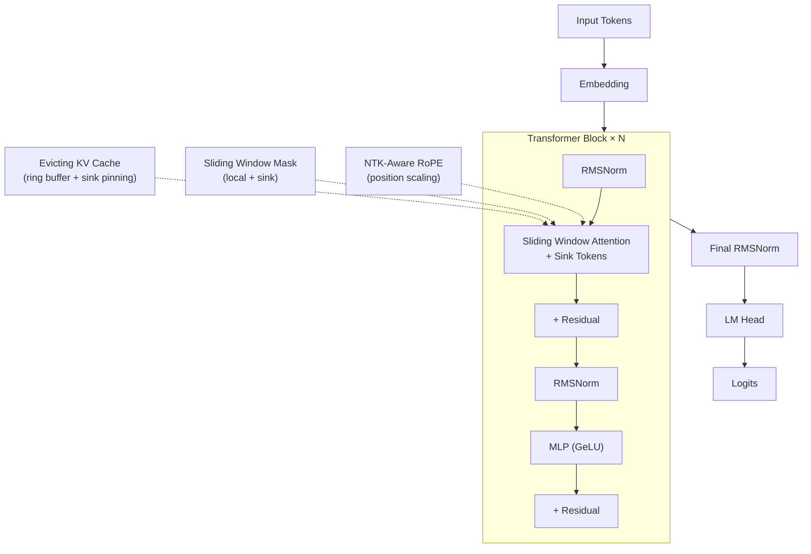

# Claude-Rust

A high-performance, terminal-integrated LLM inference and training engine built from scratch in Rust. This project implements a Transformer architecture with modern optimizations including **NTK-Aware RoPE**, **Sliding Window Attention**, **Evicting KV Cache with Sink Tokens**, RMSNorm, and support for up to **1M token context**.

## Tech Stack


## Project Architecture

The system is organized as a workspace with specialized crates for modularity and performance:

- **claude-core**: The backbone of the system — Transformer blocks, NTK-Aware RoPE (Rotary Positional Embeddings), RMSNorm, Sliding Window Attention, and Evicting KV Cache with Sink Token pinning.
- **inference**: A high-speed inference engine supporting SSE (Server-Sent Events) streaming via a web server and a flexible token generation pipeline with unbounded context support.
- **tokenizer**: A custom Byte-Pair Encoding (BPE) implementation with advanced splitting rules and specialized training scripts.
- **trainer**: An autoregressive training crate with AdamW optimization and cross-entropy loss for fine-tuning.
- **retrieval**: A vector store implementation for Retrieval-Augmented Generation (RAG) using cosine similarity over tensor embeddings.
- **agent**: A highly asynchronous orchestrator layer giving local models access to file system reading/writing and terminal execution natively.
- **claude-tui**: A terminal-based user interface built with Ratatui for real-time interaction with the models.

## Key Features

| Feature | Description | Crate |
|---------|-------------|-------|
| **NTK-Aware RoPE Scaling** | Extends context beyond training length (e.g., 4K → 1M) by scaling base frequency while keeping local features intact. | `claude-core` |
| **Sliding Window Attention** | O(N × W) attention instead of O(N²) — each token attends to a local window + global sink tokens. | `claude-core` |
| **Evicting KV Cache** | Ring-buffer KV cache with sink token pinning — bounded memory, graceful eviction of middle tokens. | `claude-core` |
| **Attention Sink Tokens** | First N tokens are pinned as global context anchors, stabilizing attention quality over long contexts. | `claude-core` |
| **Safetensors Support** | Integration with the Safetensors format for lightweight, memory-mapped weight loading. | `claude-core` |
| **Agentic Tool Calling** | Intercepts `<tool_call>` generation to seamlessly read/write files and list directories. | `agent` |
| **Terminal Execution** | Native sub-process execution allowing the model to run bash/powershell commands on the system. | `agent` |
| **Streaming Inference** | SSE combined with Ratatui for real-time, char-by-char output streaming. | `inference` / `claude-tui` |
| **Custom BPE Logic** | Fully internal tokenizer implementation without external Python dependencies. | `tokenizer` |

## Long-Context Architecture

The system achieves 1M token context through a 4-component hybrid architecture:



| Component | Problem Solved | Without It |
|-----------|---------------|------------|
| NTK RoPE Scaling | Model sees positions > training length | Garbage output past training context |
| Sliding Window Attention | O(N²) → O(N × W) compute | OOM at ~100K tokens |
| Evicting KV Cache | Memory bounded, constant VRAM | OOM at ~50K tokens |
| Sink Tokens | Attention quality stays stable | Model loses coherence over long contexts |

### Hardware Requirements (7B Model)

| Context Length | GPU VRAM | Speed |
|---------------|----------|-------|
| 32K | ~24 GB | Fast |
| 128K | ~28 GB | Moderate |
| 512K | ~32 GB | Slow |
| 1M | ~40–48 GB | Very slow, feasible |

## Getting Started

### Prerequisites

- Rust 1.70+
- LibTorch (Managed automatically via the tch-rs crate)

### Configuration

Model configuration supports both standard and long-context setups:

```yaml
# configs/model_config.yaml
n_embd: 768
n_head: 12
n_layer: 12
vocab_size: 50257
max_seq_len: 2048
original_max_seq_len: 2048   # Training context length
rope_base: 10000.0           # RoPE base frequency
window_size: 2048            # Sliding window size
sink_tokens: 4               # Global context anchors
kv_cache_capacity: 2048      # Max KV cache tokens
```

For 1M context, see [`configs/million_context.toml`](configs/million_context.toml).

### Training a Tokenizer

Use the provided PowerShell script to train the BPE tokenizer on a raw text corpus:

```powershell
./scripts/train_tokenizer.ps1
```

### Running the Inference Server

Start the Axum-based inference server:

```bash
cargo run -p inference --bin inference-server
```

### Starting the TUI

Launch the terminal chat interface:

```bash
cargo run -p claude-tui
```

## Production Roadmap

- [x] **Long-Context Architecture**: NTK RoPE, Sliding Window Attention, Evicting KV Cache, Sink Tokens
- [ ] **Quantization**: Implementation of INT8/4-bit linear quantization for model weights.
- [ ] **GQA (Grouped-Query Attention)**: Adding support for GQA to further reduce memory bandwidth usage.
- [ ] **Continuous Batching**: Refactoring the generator for high-throughput multi-request processing.
- [ ] **Markdown Rendering**: Integration of rich text formatting within the terminal interface.

## License

This project is licensed under the MIT License.
