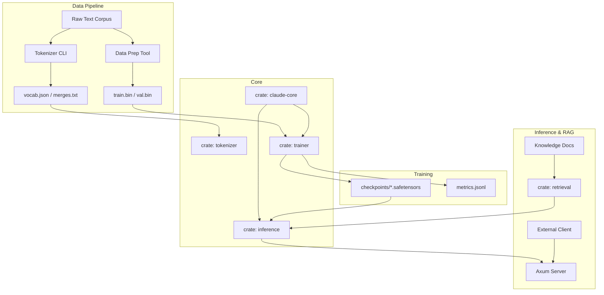

# Claude-Rust Architecture Overview

This document outlines the high-level architecture and component interaction within the Claude-Rust project, a pure Rust Transformer LLM.

## System Diagram

The system is designed as a modular pipeline, with clear separation of concerns between data processing, model definition, training, and inference.

```mermaid
graph TD
    subgraph Data Pipeline
        RawText[Raw Text Corpus] --> TokenizerCLI[Tokenizer CLI]
        RawText --> DataPrep[Data Prep Tool]
        TokenizerCLI --> Vocab[vocab.json / merges.txt]
        DataPrep --> EncodedData[train.bin / val.bin]
    end

    subgraph Core
        Vocab --> TokenizerLib[crate: tokenizer]
        EncodedData --> TrainerLib[crate: trainer]
        ModelDef[crate: claude-core] --> TrainerLib
        ModelDef --> InferenceLib[crate: inference]
    end

    subgraph Training
        TrainerLib --> Checkpoints[checkpoints/*.safetensors]
        TrainerLib --> Logs[metrics.jsonl]
    end

    subgraph Inference & RAG
        Checkpoints --> InferenceLib
        InferenceLib --> WebServer[Axum Server]
        Client[External Client] --> WebServer
        KnowledgeBase[Knowledge Docs] --> RetrievalLib[crate: retrieval]
        RetrievalLib --> InferenceLib
    end
```

## Component Breakdown

### 1. Tokenizer (`crates/tokenizer`)

*   **Role**: Converts raw text into numerical token IDs and vice-versa.
*   **Implementation**: Pure Rust BPE (Byte-Pair Encoding).
*   **Key Modules**:
    *   `bpe.rs` — Full BPE encoder/decoder with vocabulary management.
    *   `trainer.rs` — Parallel BPE training using `rayon` on large corpora.
    *   `byte_tokenizer.rs` — Byte-level fallback encoding (GPT-2 style, tokens 0–255).
    *   `interfaces.rs` — `Tokenize` and `TokenizeWithLimit` traits.
    *   `vocab.rs` — Vocabulary serialization (JSON load/save).
    *   `error.rs` — Custom error types.
*   **Tools**: `tools/tokenizer_cli` exposes CLI commands (`train`, `encode`, `decode`).

### 2. Core Model (`crates/claude-core`)

*   **Role**: Defines the Transformer architecture with long-context support (up to 1M tokens).
*   **Implementation**: Hardware-accelerated tensor operations via `tch-rs` (LibTorch bindings).
*   **Key Modules**:
    *   `transformer.rs` — `ClaudeTransformer` and `Block` structs (GPT-style decoder-only).
    *   `attention.rs` — Sliding Window Attention with sink token support, O(N × W) complexity.
    *   `rotary.rs` — NTK-Aware RoPE with explicit position indexing for cache eviction correctness.
    *   `kv_cache.rs` — `EvictingKVCache` ring buffer with sink pinning and middle-token eviction.
    *   `embedding.rs` — Combined token + position embedding layer.
    *   `head.rs` — LM head (linear projection → vocab logits, no bias).
    *   `layer_norm.rs` — RMSNorm (pre-norm topology).
    *   `positional.rs` — Sinusoidal positional encoding (alternative to RoPE).
    *   `init.rs` — Weight initialization, `count_parameters()`, `print_param_summary()`.
    *   `safetensors_util.rs` — Safetensors weight loading.
    *   `config.rs` — `ModelConfig` with backward-compatible long-context fields.
    *   `block.rs` — Re-export of `Block` for standalone usage.

### 3. Tensors (`crates/tensors`)

*   **Role**: Abstraction layer over tensor backends.
*   **Purpose**: Allows switching between `tch` (PyTorch C++ backend), `burn` (wgpu/Vulkan/Metal), or `ndarray` (CPU-only) without rewriting model code.
*   **Key Modules**:
    *   `backend.rs` — `TensorBackend` trait (zeros, ones, matmul, softmax, layer_norm, add).
    *   `tensor_ops.rs` — Utilities: `numel`, `contiguous_strides`, `broadcastable` check.
    *   `cuda.rs` — Device listing, `CudaMemoryInfo`, `estimate_vram_bytes()`.
    *   `lib.rs` — `Backend` enum (Tch/Burn/NdArray) and `TensorDevice` abstraction.

### 4. Trainer (`crates/trainer`)

*   **Role**: Orchestrates the full training pipeline.
*   **Key Modules**:
    *   `train.rs` — Core `Trainer` struct with forward/backward/step loop.
    *   `train_loop.rs` — High-level training loop wiring all components together.
    *   `data_loader.rs` — Streaming `DataLoader` for binary token files (u32 LE) with sequential batching and wraparound.
    *   `dataset.rs` — In-memory `TextDataset` with random batch sampling.
    *   `checkpoint.rs` — `CheckpointManager` for save/load/resume with metadata tracking.
    *   `schedule.rs` — `CosineScheduler` with linear warmup, `ConstantScheduler`, `apply_lr()`.
    *   `metrics.rs` — `MetricsLogger` with JSONL output, `StepMetrics` (loss, PPL, LR, throughput).
    *   `optim.rs` — `AdamWConfig` wrapper with gradient clipping configuration.

### 5. Inference (`crates/inference`)

*   **Role**: Serves the trained model for text generation with long-context support.
*   **Key Modules**:
    *   `main.rs` — Axum SSE server with `/generate` POST endpoint.
    *   `generator.rs` — Autoregressive decoding with `EvictingKVCache` and unbounded generation.
    *   `sampling.rs` — Temperature, Top-K, and Top-P (Nucleus) sampling strategies.
    *   `batcher.rs` — Continuous batching for multi-request throughput.
    *   `server.rs` — `ServerConfig` struct (host, port, max concurrent requests).
    *   `cli.rs` — Clap-based CLI with `--prompt`, `--max-tokens`, `--temperature`, `--serve` flags.
    *   `lib.rs` — Model loading, `load_model()` from checkpoint + config.

### 6. Retrieval (`crates/retrieval`) — RAG

*   **Role**: Provides relevant context from a knowledge base to augment generation.
*   **Key Modules**:
    *   `chunker.rs` — `chunk_text()` with sentence-boundary splitting, configurable overlap and chunk size.
    *   `embedder.rs` — `Embedder` trait + `MeanPoolEmbedder` using token embedding table.
    *   `index.rs` — `FlatIndex` brute-force cosine similarity search (swappable with FAISS/HNSW).
    *   `faiss_compat.rs` — `FaissConfig` with IVF/PQ factory string generation.
    *   `lib.rs` — `VectorStore` for document management and similarity search.
*   **Flow**: Query → Embed → Search Index → Retrieve Chunks → Prepend to Prompt → Generate.

### 7. Quantization (`crates/quant`)

*   **Role**: Reduces model size for inference on consumer hardware.
*   **Key Modules**:
    *   `q8.rs` — `QuantizedTensorI8` with symmetric per-tensor INT8 quantization (4x compression).
    *   `q4.rs` — `QuantizedTensorQ4` with per-group 4-bit packing, two nibbles per byte (~8x compression, group size = 128).
    *   `lib.rs` — `QuantFormat` enum, `QuantStats` with symmetric/asymmetric calibration.

### 8. Agent (`crates/agent`)

*   **Role**: Agentic orchestrator giving the model access to external tools.
*   **Key Modules**:
    *   `orchestrator.rs` — Agentic loop: intercepts `<tool_call>` in model output, dispatches tools, feeds results back.
    *   `tools/fs.rs` — ReadFile, WriteFile, ListDir, SearchCodebase.
    *   `tools/cmd.rs` — RunCommand (bash/powershell subprocess execution).
    *   `tools/mod.rs` — `Tool` trait with name/description/execute interface.

### 9. TUI (`crates/claude-tui`)

*   **Role**: Terminal-based chat interface for real-time interaction.
*   **Key Modules**:
    *   `main.rs` — Tokio event loop, agent integration, inference client.
    *   `ui.rs` — Ratatui rendering (chat pane, input box, status bar).
    *   `event.rs` — Keyboard/resize event handling.
    *   `app.rs` — Application state management.

### 10. Utils (`crates/utils`)

*   **Role**: Shared utilities across the workspace.
*   **Key Modules**:
    *   `config.rs` — `load_yaml()`, `load_json()`, `save_yaml()`, `save_json()` helpers.
    *   `fs.rs` — `ensure_dir()`, `file_size()`, `human_size()`, `list_files_with_ext()`.
    *   `logging.rs` — `init()` and `init_with_level()` wrapping `env_logger`.

## Data Flow

1.  **Preprocessing**: Raw text -> `tokenizer_cli train` -> `vocab.json`.
2.  **Encoding**: Raw text + `vocab.json` -> `data_prep` -> `train.bin` (u32 IDs).
3.  **Training**: `train.bin` -> `trainer` -> `model.safetensors` (checkpoints).
4.  **Inference**: `model.safetensors` + `vocab.json` -> `inference` server -> User.
