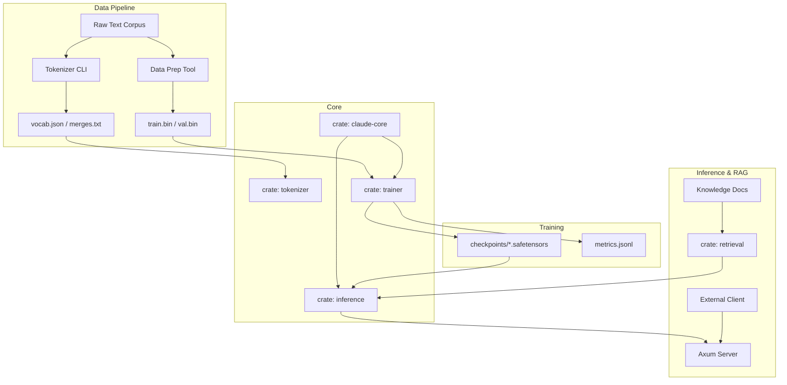

# Claude-Rust Architecture Overview

This document outlines the high-level architecture and component interaction within the Claude-Rust project, a pure Rust Transformer LLM.

## System Diagram

The system is designed as a modular pipeline, with clear separation of concerns between data processing, model definition, training, and inference.

```mermaid
graph TD
    subgraph Data Pipeline
        RawText[Raw Text Corpus] --> TokenizerCLI[Tokenizer CLI]
        RawText --> DataPrep[Data Prep Tool]
        TokenizerCLI --> Vocab[vocab.json / merges.txt]
        DataPrep --> EncodedData[train.bin / val.bin]
    end

    subgraph Core
        Vocab --> TokenizerLib[crate: tokenizer]
        EncodedData --> TrainerLib[crate: trainer]
        ModelDef[crate: claude-core] --> TrainerLib
        ModelDef --> InferenceLib[crate: inference]
    end

    subgraph Training
        TrainerLib --> Checkpoints[checkpoints/*.safetensors]
        TrainerLib --> Logs[metrics.jsonl]
    end

    subgraph Inference & RAG
        Checkpoints --> InferenceLib
        InferenceLib --> WebServer[Axum Server]
        Client[External Client] --> WebServer
        KnowledgeBase[Knowledge Docs] --> RetrievalLib[crate: retrieval]
        RetrievalLib --> InferenceLib
    end
```

## Component Breakdown

### 1. Tokenizer (`crates/tokenizer`)

*   **Role**: Converts raw text into numerical token IDs and vice-versa.
*   **Implementation**: Pure Rust BPE (Byte-Pair Encoding).
*   **Key Features**:
    *   **Parallelism**: Uses `rayon` for fast multi-threaded training on large corpora.
    *   **Byte Fallback**: Handles unknown characters gracefully via byte-level encoding (similar to GPT-2/GPT-4).
    *   **Interface**: `encode(&str) -> Vec<u32>`, `decode(&[u32]) -> String`.
*   **Tools**: `tools/tokenizer_cli` exposes CLI commands (`train`, `encode`, `decode`).

### 2. Core Model (`crates/claude-core`)

*   **Role**: Defines the Transformer architecture with long-context support (up to 1M tokens).
*   **Implementation**: Hardware-accelerated tensor operations via `tch-rs` (LibTorch bindings).
*   **Architecture**:
    *   **Decoder-Only Transformer**: Standard GPT-style architecture.
    *   **NTK-Aware RoPE**: Rotary positional embeddings with Neural Tangent Kernel scaling — stretches low-frequency positional features to handle context lengths far beyond training (e.g., 4K → 1M).
    *   **Sliding Window Attention**: O(N × W) attention — each token attends to a local window plus global sink tokens, replacing O(N²) full attention.
    *   **Evicting KV Cache**: Pre-allocated ring buffer with sink token pinning. When full, evicts middle tokens while preserving global anchors (sink tokens) and the most recent window.
    *   **Attention Sink Tokens**: First N tokens pinned as global context anchors to stabilize attention quality over extremely long contexts.
    *   **Normalization**: RMSNorm (Pre-norm topology for training stability).
    *   **Activation**: GeLU.
*   **Key Traits**: Modular `Block` struct, configurable `ModelConfig` with backward-compatible long-context fields.

### 3. Tensors (`crates/tensors`)

*   **Role**: Abstraction layer over the tensor backend.
*   **Purpose**: Allows switching between `tch` (PyTorch C++ backend), `burn` (wgpu/pure Rust), or `ndarray` (CPU-only prototype) without rewriting model code.
*   **Interfaces**: `Tensor`, `Device`, basic ops (`matmul`, `softmax`, `layer_norm`, etc.).

### 4. Trainer (`crates/trainer`)

*   **Role**: Orchestrates the training process.
*   **Components**:
    *   **DataLoader**: Efficiently streams `train.bin` (memory-mapped) into batches of `(context_len, batch_size)`.
    *   **Optimizer**: AdamW implementation with weight decay.
    *   **Scheduler**: Linear warmup with cosine decay learning rate schedule.
    *   **Checkpointing**: Saves model weights to `.safetensors` format periodically.
    *   **Monitoring**: Logs loss, perplexity, and learning rate to stdout and JSON lines.
*   **Parallelism**: Supports data parallelism across multiple GPUs via `tch` distributed utilities (future).

### 5. Inference (`crates/inference`)

*   **Role**: Serves the trained model for text generation with long-context support.
*   **Components**:
    *   **Server**: Async `axum` web server with SSE streaming.
    *   **Generator**: Autoregressive decoding loop with unbounded generation.
        *   **Evicting KV Cache**: Uses `claude-core`'s `EvictingKVCache` with ring buffer + sink pinning. No hard sequence length cutoff — the cache gracefully evicts middle tokens as generation extends.
        *   **Position Tracking**: Tracks `total_tokens_seen` for correct NTK-scaled RoPE positioning even after cache eviction.
    *   **Sampler**:
        *   **Temperature**: Controls randomness.
        *   **Top-K**: Limits sampling to top K probabilities.
        *   **Top-P (Nucleus)**: Limits sampling to cumulative probability P.

### 6. Retrieval (`crates/retrieval`) (RAG)

*   **Role**: Provides relevant context from a knowledge base to augment generation.
*   **Implementation**:
    *   **Embedder**: Converts text chunks into vector embeddings (using a smaller model or the main model's embedding layer).
    *   **Index**: HNSW (Hierarchical Navigable Small World) or simple Flat Index for nearest neighbor search.
*   **Flow**: Query -> Embed -> Search Index -> Retrieve Chunks -> Prepend to Prompt -> Generate.

### 7. Quantization (`crates/quant`)

*   **Role**: Reduces model size for inference on consumer hardware.
*   **Techniques**:
    *   **Int8**: Quantize weights to 8-bit integers.
    *   **4-bit (Q4)**: Aggressive compression (e.g., GPTQ/GGML style).
*   **Status**: Utilities for converting `.safetensors` headers and weights.

## Data Flow

1.  **Preprocessing**: Raw text -> `tokenizer_cli train` -> `vocab.json`.
2.  **Encoding**: Raw text + `vocab.json` -> `data_prep` -> `train.bin` (u32 IDs).
3.  **Training**: `train.bin` -> `trainer` -> `model.safetensors` (checkpoints).
4.  **Inference**: `model.safetensors` + `vocab.json` -> `inference` server -> User.
